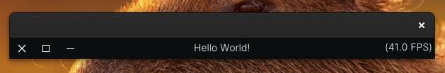

# skorpix-experiments
 Just a repo to experiment with imgui or skorpix stuff

## Titlebar screenshot



 If you wanna build and run project
```sh
./build_and_run.sh (titlebar)
```

 If you want to edit the project and recompile it every time the file changes, but you need to install the inotifywait tool
```sh
./watcher.sh (titlebar)
```